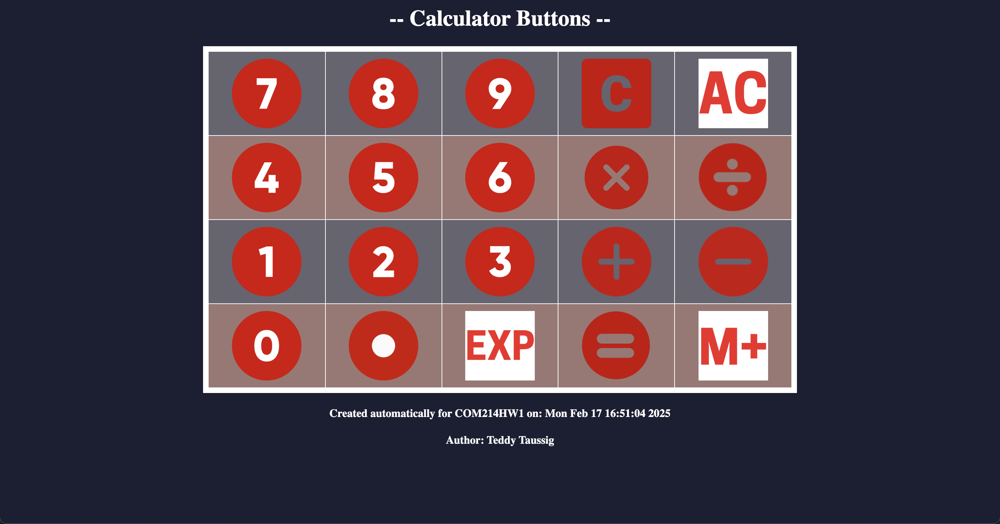
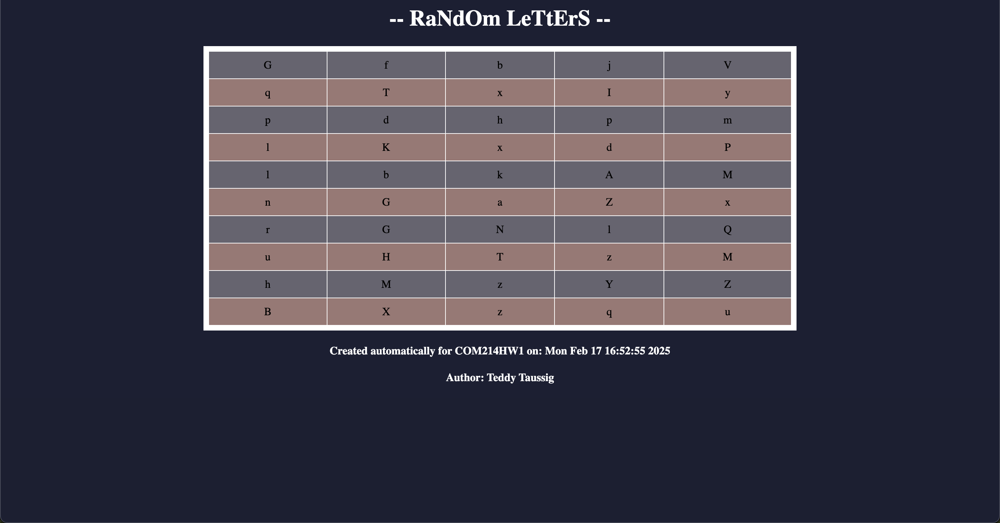

# HTML Generator
I utilized Python to read a text file, and then to take that text and used a Python file to generate an HTML webpage. One was in a table format with the calculator buttons, and one was a grid with the letters. 

